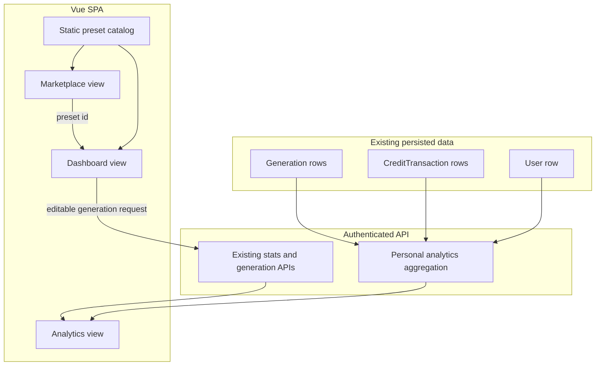

# feat: Complete unfinished Analytics and Marketplace surfaces

## Summary

Complete the two visible unfinished routes in staged form: ship personal-user Analytics from existing generation and credit data first, then replace Marketplace with curated prompt/style presets that can be applied to Dashboard without adding creator-commerce infrastructure.

---

## Problem Frame

`/analytics` and `/marketplace` are already first-class navigation items, but both still render placeholder pages. The origin requirements define this as a product-completeness gap: the generation, gallery, credits, and admin flows exist, while two promised surfaces return no practical value.

This plan preserves the brainstorm's staging: Analytics is personal-only in Phase 1, admin/global analytics are deferred, and Marketplace v1 is a curated preset/template browser rather than a paid marketplace or third-party model store.

---

## Requirements

**Analytics data and access**

- R1. Provide a personal Analytics data contract for the authenticated user only, derived from existing `Generation` and `CreditTransaction` rows. Covers origin R1-R4, R6, F1, AE1, AE2.
- R2. Analytics must expose activity, status, success/failure, credit spend/refund, resolution mix, aspect-ratio mix, and recent generation data without adding a separate event pipeline. Covers origin R2-R4.
- R3. Empty-history users must receive a valid analytics payload that the UI can render as a polished empty state. Covers origin AE2.
- R4. Admin/global analytics must remain out of active scope; the first backend contract must not leak other users' activity. Covers origin R6 and scope boundaries.

**Analytics UI**

- R5. Replace the `/analytics` placeholder with a finished page in the existing glassmorphism shell, using lightweight metric cards, breakdown visuals, and recent activity rather than a new charting dependency. Covers origin R1, R5, AE1, AE2.
- R6. The Analytics UI must render credible states for non-empty data, all-zero data, failed generations, and refunds. Covers origin R2-R5.

**Marketplace and preset handoff**

- R7. Replace the `/marketplace` placeholder with a curated built-in catalog of preset/template cards. Covers origin R7, R8.
- R8. Preset cards must communicate intended output, style/prompt direction, cost/resolution suggestions when useful, and an apply action. Covers origin R8.
- R9. Applying a preset must route the user to Dashboard with editable generation inputs prefilled before any credit spend occurs. Covers origin R9, F2, AE3.
- R10. Marketplace v1 must not introduce user uploads, paid packs, moderation, payouts, separate marketplace billing, or database-backed creator commerce. Covers origin R10, R11, AE4.

**Stability and handoff**

- R11. Existing flows for login/register, Dashboard generation, Gallery, Admin credits, image serving, and SPA routing must remain stable. Covers origin R14.
- R12. Documentation should stop describing Analytics and Marketplace as pure placeholders once the implementation lands. Covers origin success criteria.

---

## Key Technical Decisions

- **Backend-owned Analytics aggregation:** Add a personal analytics endpoint instead of deriving everything client-side. The backend can read both generations and credit transactions consistently, enforce `UserID`, and keep the UI simple.
- **No new Analytics persistence:** Use existing `Generation` and `CreditTransaction` rows for Phase 1. New tables or event streams are deferred because the requested metrics are already derivable.
- **Personal-only auth boundary:** Reuse the existing authenticated route group and current-user context. Do not place the first Analytics contract under admin middleware, and do not add global filters yet.
- **Static Marketplace catalog:** Store v1 presets in frontend source as curated data. This keeps Phase 2 useful without adding admin CRUD, migrations, moderation, or settlement logic.
- **Query-param preset handoff:** Apply Marketplace presets by routing to Dashboard with a preset identifier. Dashboard resolves that identifier from the same curated catalog and preloads editable inputs.
- **No charting dependency for v1:** Use CSS/Tailwind cards, bars, grids, and tables. The current frontend has no chart library, and the required breakdowns are simple enough to render directly.

---

## High-Level Technical Design

Analytics is a read-only authenticated data flow over existing records. Marketplace is a frontend catalog flow; the only cross-page state is the preset identifier used to prefill Dashboard inputs.

---

## Implementation Units

### U1. Personal Analytics API contract

- **Goal:** Add an authenticated personal analytics response that aggregates existing user-owned generations and credit transactions. Covers R1-R4, R11, origin F1, AE1, AE2.
- **Dependencies:** None.
- **Files:**
  - `backend/internal/handlers/profile.go` or `backend/internal/handlers/analytics.go`
  - `backend/internal/handlers/handlers.go`
  - `backend/internal/server/router.go`
  - `backend/internal/handlers/analytics_test.go`
- **Approach:**
  - Add a `GET /api/me/analytics` style endpoint inside the existing authenticated group.
  - Build the response from the current user's rows only: generation counts by status, success rate, recent generations, cost totals, refunds, resolution distribution, aspect-ratio distribution, and current user/credit context.
  - Keep the contract read-only and personal. Do not add admin/global parameters.
  - Prefer plain DTO structs near handlers; move to service only if implementation needs shared business logic.
- **Patterns to follow:**
  - `backend/internal/handlers/profile.go` for current-user reads and JSON response shape.
  - `backend/internal/handlers/generation.go` for generation ownership filtering.
  - `backend/internal/service/concurrency_test.go` for temporary SQLite setup patterns if a handler-level test needs a real DB.
- **Test scenarios:**
  - Covers AE1. Seed one user with completed, failed, pending, and processing generations plus generation/refund credit transactions; request `/api/me/analytics`; expect correct totals, rates, cost/refund values, distributions, and recent activity ordering.
  - Covers AE2. Seed a user with no generations or credit transactions beyond signup; expect zero counts, empty distributions/recent activity, and no server error.
  - Seed two users with distinct generations and credit transactions; authenticate as one; expect the response to exclude the other user's rows entirely.
  - Seed failed generations with refund transactions; expect refund totals to count positive `refund` entries and not double-count admin injections or signup bonuses as generation spend.
  - Request without auth; expect existing auth middleware behavior rather than a public analytics response.
- **Verification:** The endpoint response is deterministic for seeded data, respects user isolation, and gives the frontend every field needed for the planned Analytics page without extra client aggregation over unrelated users.

### U2. Frontend Analytics client contract

- **Goal:** Add typed frontend access to the Analytics API so the view can consume a stable contract. Covers R1-R6.
- **Dependencies:** U1.
- **Files:**
  - `frontend/src/types.ts`
  - `frontend/src/api/client.ts`
  - `frontend/src/lib/format.ts`
  - Test file path: N/A — this repo has no frontend test runner; validate through TypeScript and browser scenarios in U3.
- **Approach:**
  - Add `Analytics`-oriented TypeScript interfaces for summary cards, breakdown rows, credit totals, and recent activity.
  - Add an `AnalyticsAPI` helper beside `AuthAPI`, `GenAPI`, and `AdminAPI`.
  - Add small formatting helpers only if they are reusable across Analytics cards; do not overbuild a charting abstraction.
- **Patterns to follow:**
  - `frontend/src/api/client.ts` helper objects and response unwrapping.
  - `frontend/src/types.ts` for shared DTO definitions.
  - `frontend/src/lib/format.ts` for cost constants and display helpers.
- **Test scenarios:**
  - Typecheck the frontend with the new DTOs used by Analytics; expect no implicit-any or property drift between API helper and view.
  - Simulate API helper consumption in the Analytics view with non-empty and empty payload shapes; expect the same fields to drive cards, breakdowns, and recent activity without ad-hoc casts.
- **Verification:** The API helper and types compile cleanly and make the Analytics view independent of raw axios response shapes.

### U3. Completed Analytics page

- **Goal:** Replace `Analytics.vue` placeholder with a finished personal dashboard. Covers R5, R6, origin F1, AE1, AE2.
- **Dependencies:** U1, U2.
- **Files:**
  - `frontend/src/views/Analytics.vue`
  - `frontend/src/lib/format.ts`
  - Test file path: N/A — use frontend build/typecheck plus manual browser verification.
- **Approach:**
  - Render top-level metric cards for total generations, completed/failed counts, success rate, credits spent/refunded, and current balance.
  - Render lightweight distribution visuals for resolution and aspect-ratio mixes using existing Tailwind/glass styles.
  - Render recent activity with status, prompt, dimensions, cost, and relative time.
  - Include polished loading, error, and empty states; empty state should prompt users to generate rather than showing broken charts.
  - Keep the page inside the existing `AppShell` route behavior; do not add another layout layer.
- **Patterns to follow:**
  - `frontend/src/views/Admin.vue` for bento/grid sections, table styling, loading-ish status cards, and toast/error treatment.
  - `frontend/src/views/Gallery.vue` for profile/metric cards and empty state style.
  - `frontend/src/views/Dashboard.vue` for generation status wording and visual language.
- **Test scenarios:**
  - Covers AE1. Log in as a user with completed and failed generations; open `/analytics`; expect real metrics and recent activity instead of the placeholder copy.
  - Covers AE2. Log in as a new/no-history user; open `/analytics`; expect a finished empty state and no divide-by-zero/NaN percentages.
  - Force the API call to fail in development or via browser devtools; expect an error state that does not break navigation.
  - Verify failed/refunded generations are distinguishable from successful completed generations in both summary and activity list.
- **Verification:** `Analytics.vue` no longer contains coming-soon placeholder content; the page renders correctly across empty, mixed, and error states in the authenticated shell.

### U4. Static Marketplace preset catalog

- **Goal:** Create a curated built-in preset/template catalog and render Marketplace as a real browsing surface. Covers R7, R8, R10, origin F2, AE4.
- **Dependencies:** None.
- **Files:**
  - `frontend/src/types.ts`
  - `frontend/src/lib/presets.ts`
  - `frontend/src/views/Marketplace.vue`
  - Test file path: N/A — validate through TypeScript and browser scenarios.
- **Approach:**
  - Define a small `Preset`/`MarketplacePreset` shape with stable id, title, description, prompt seed, style, suggested resolution/aspect ratio, tags, and visual metadata.
  - Keep the catalog in frontend source for v1; do not add backend models or migrations.
  - Render filterable/browsable cards if low-cost; keep filters local and optional rather than building a persistence layer.
  - Each card should have an apply action and enough preview text that the user understands the creative direction.
- **Patterns to follow:**
  - `frontend/src/views/Marketplace.vue` existing icon and page mood as starting point, but replace placeholder body.
  - `frontend/src/components/ImageCard.vue` and `frontend/src/views/Gallery.vue` for card hover/visual density.
  - Existing `material-symbols` usage for category icons.
- **Test scenarios:**
  - Covers AE4. Inspect the implementation scope; expect no backend marketplace tables, paid-pack routes, upload forms, moderation UI, or billing code.
  - Open `/marketplace`; expect multiple curated cards with title, description, tags/creative direction, and an apply action.
  - Use local filtering/category selection if included; expect it to only change visible cards and not require network calls.
  - Verify every preset id is stable and unique so Dashboard handoff can resolve it.
- **Verification:** Marketplace reads as a useful preset browser, not a coming-soon placeholder, and remains static/curated as required.

### U5. Marketplace-to-Dashboard preset application

- **Goal:** Let users apply Marketplace presets to Dashboard inputs while keeping final generation editable before credit spend. Covers R9, R11, origin F2, AE3.
- **Dependencies:** U4.
- **Files:**
  - `frontend/src/views/Marketplace.vue`
  - `frontend/src/views/Dashboard.vue`
  - `frontend/src/lib/presets.ts`
  - `frontend/src/router/index.ts` if route typing or query handling needs adjustment
  - Test file path: N/A — validate through TypeScript and browser scenarios.
- **Approach:**
  - On preset apply, route to Dashboard with a stable preset id in query parameters.
  - Dashboard resolves the id from `frontend/src/lib/presets.ts` and preloads prompt/style/resolution/aspect ratio fields.
  - The generated request still goes through the existing Dashboard `generate()` flow; no generation should start automatically from Marketplace.
  - Unknown or stale preset ids should fail soft: show Dashboard normally or surface a small non-blocking message rather than breaking the route.
- **Patterns to follow:**
  - `frontend/src/components/TopBar.vue` for simple `router.push('/')` navigation to Dashboard.
  - `frontend/src/views/Dashboard.vue` existing refs for prompt, style, resolution, and aspect selection.
  - `frontend/src/router/index.ts` current auth guard; Marketplace and Dashboard remain protected routes.
- **Test scenarios:**
  - Covers AE3. Click apply on a preset; expect navigation to Dashboard with editable prompt/style/resolution/aspect populated and no credit deduction until Generate is clicked.
  - Edit the prefilled prompt, then generate; expect the modified prompt to be sent through the existing generation flow.
  - Navigate directly to Dashboard with an unknown preset id; expect no crash and normal Dashboard usability.
  - Apply one preset, return to Marketplace, apply another; expect the second preset to replace the editable fields cleanly.
- **Verification:** Preset application reduces setup effort but preserves user review and the existing credit-spend boundary.

### U6. Documentation and regression verification

- **Goal:** Align project docs with the completed routes and verify the staged work did not regress core flows. Covers R11, R12, origin F3 and success criteria.
- **Dependencies:** U1-U5.
- **Files:**
  - `README.md`
  - `SPEC.md` if the implementation intentionally changes the documented contract
  - Test file path: N/A — documentation and whole-app verification unit.
- **Approach:**
  - Update README language that currently calls Marketplace and Analytics placeholders.
  - If a new analytics endpoint is added, document it alongside existing API contracts where the project already keeps those contracts.
  - Keep docs honest about deferred admin/global analytics and marketplace commerce features.
- **Patterns to follow:**
  - `README.md` route table and configuration/API sections.
  - `SPEC.md` API and view-contract sections if this repo treats SPEC as the source-of-truth for implemented surfaces.
- **Test scenarios:**
  - Run backend tests; expect existing concurrency/credit behavior and new analytics aggregation tests to pass.
  - Run frontend typecheck/build; expect Analytics, Marketplace, and Dashboard handoff to compile.
  - Manually verify login → Analytics, login → Marketplace → apply preset → Dashboard → generate, Gallery still shows completed outputs, and Admin credit injection still works for admin users.
  - Verify unauthenticated access to `/analytics` and `/marketplace` still redirects to login through the existing route guard.
- **Verification:** Docs no longer contradict the shipped UI, and a basic authenticated product loop still works end-to-end.

---

## Acceptance Examples

- AE1. Existing-history Analytics: Given a signed-in user with completed and failed generations plus credit transactions, when they open `/analytics`, then they see real usage, status, and credit information instead of placeholder copy.
- AE2. Empty-history Analytics: Given a newly registered user with no generations, when they open `/analytics`, then the page shows a finished empty state without broken charts, NaN values, or server errors.
- AE3. Preset application: Given a user selects a marketplace preset, when they apply it, then Dashboard opens with editable generation inputs populated and no generation starts until the user clicks Generate.
- AE4. Marketplace scope guard: Given Marketplace v1 is implemented, when reviewing the changed surface, then there are no creator uploads, paid packs, moderation workflows, payout systems, or separate marketplace billing.

---

## Scope Boundaries

### Active Scope

- Personal-user Analytics only.
- Backend aggregation over existing `Generation`, `CreditTransaction`, and `User` data.
- Lightweight frontend visuals without a charting dependency.
- Curated/static Marketplace presets.
- Preset handoff to Dashboard with editable inputs.

### Deferred to Follow-Up Work

- Admin/global/platform-wide Analytics.
- Date-range filtering, export/reporting, cohort analysis, or advanced BI.
- Database-backed preset management or admin-editable Marketplace content.
- User-submitted content, creator profiles, moderation queues, paid packs, payouts, or revenue sharing.
- Separate marketplace billing distinct from generation credits.

### Outside This Product Pass

- Full third-party model marketplace.
- Broad rewrites of generation, credits, gallery, or admin systems just to support these pages.

---

## System-Wide Impact

- **Auth/data isolation:** Analytics introduces a new read surface over user activity. It must follow the same current-user boundary used by generation listing and stats.
- **API surface:** A new personal analytics endpoint becomes part of the frontend/backend contract and should be documented with the same care as existing `/api/me/stats` and generation endpoints.
- **Navigation flow:** Marketplace begins driving Dashboard input state. The handoff must stay reversible and editable so it does not bypass the existing credit confirmation moment.
- **Build output:** If production assets are committed or embedded in this repo's workflow, the implementer may need to rebuild frontend assets into `backend/web/dist` after frontend changes.

---

## Risks & Dependencies

- **Analytics query drift:** Aggregation logic can silently diverge from UI expectations. Mitigation: backend tests should seed explicit generation/transaction combinations and assert totals/distributions.
- **Credit semantics ambiguity:** Spend/refund metrics must not count signup bonuses or admin injections as generation spend. Mitigation: group by `CreditTransaction.Reason` and keep labels clear.
- **Frontend-only Marketplace limits:** Static presets ship quickly but are not editable by admins. This is intentional for v1 and documented as deferred work.
- **Preset handoff fragility:** Query-param ids can go stale after catalog changes. Mitigation: unknown ids should fail soft and Dashboard should remain usable.
- **No frontend test runner:** UI regressions rely on typecheck/build plus manual browser verification unless a future plan adds a frontend test stack.

---

## Documentation / Operational Notes

- Update `README.md` route descriptions so Analytics and Marketplace no longer read as placeholders.
- If `SPEC.md` remains the implementation contract, add the personal analytics endpoint and revised view descriptions there too.
- Keep `.env` and deployment configuration unchanged; this plan should not require new runtime settings.

---

## Sources / Research

- `docs/brainstorms/2026-06-04-unfinished-features-roadmap-requirements.md` is the origin and source of product scope.
- `README.md` currently states Marketplace and Analytics are coming-soon placeholders.
- `SPEC.md` documents existing domain rules, API contracts, frontend view expectations, and acceptance checklist.
- `backend/internal/models/models.go` defines `User`, `Generation`, and `CreditTransaction`, which are sufficient for Phase 1 Analytics aggregation.
- `backend/internal/handlers/profile.go`, `backend/internal/handlers/generation.go`, and `backend/internal/server/router.go` show the existing authenticated user data patterns to extend.
- `frontend/src/api/client.ts`, `frontend/src/types.ts`, and `frontend/src/views/Admin.vue` show current API helper, DTO, and bento/table UI patterns.
- `frontend/src/views/Analytics.vue` and `frontend/src/views/Marketplace.vue` are the placeholder views to replace.
